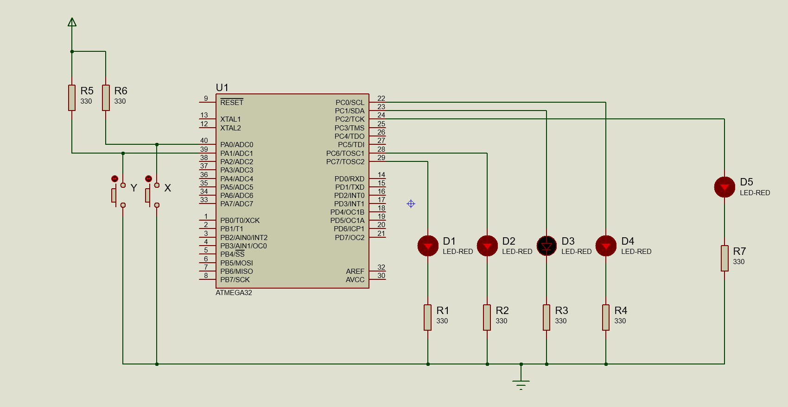
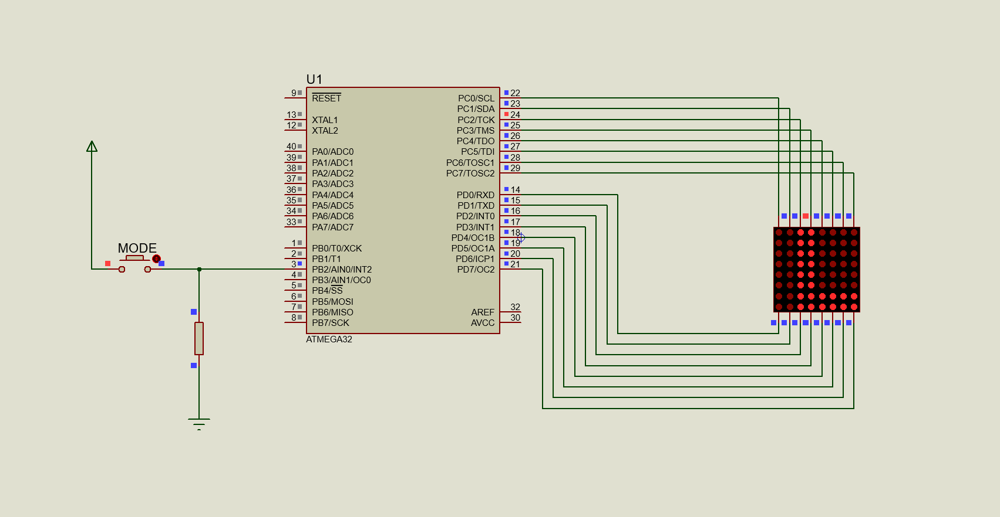
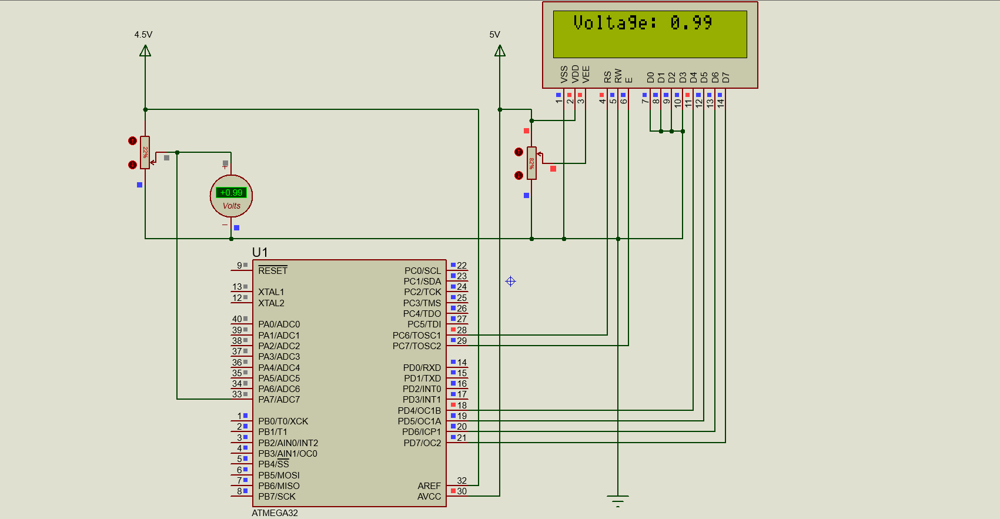
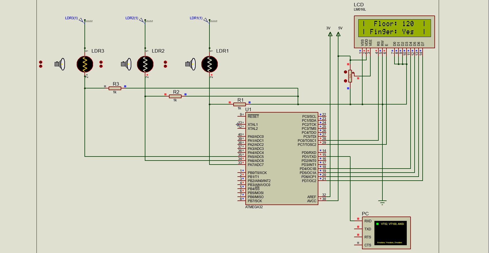
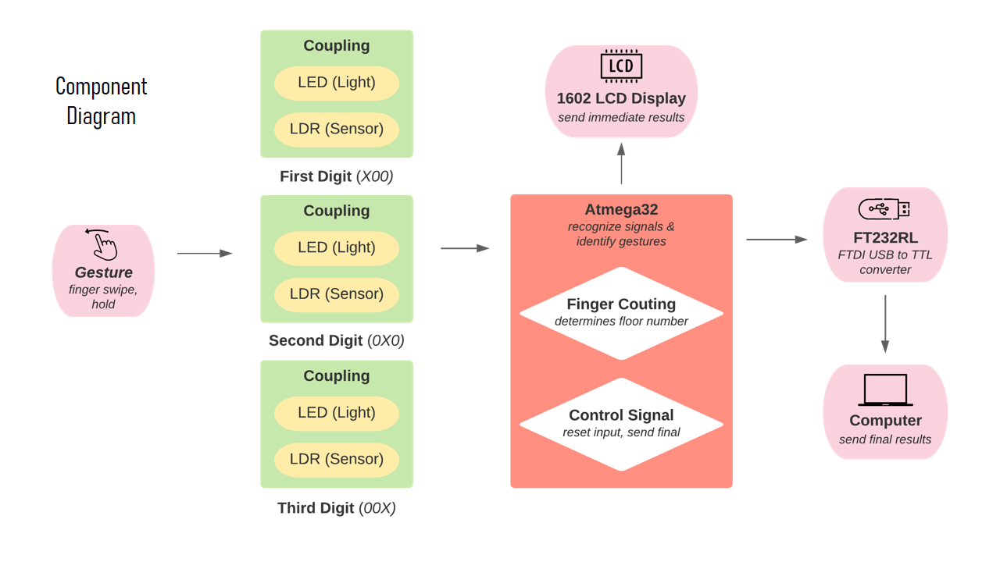
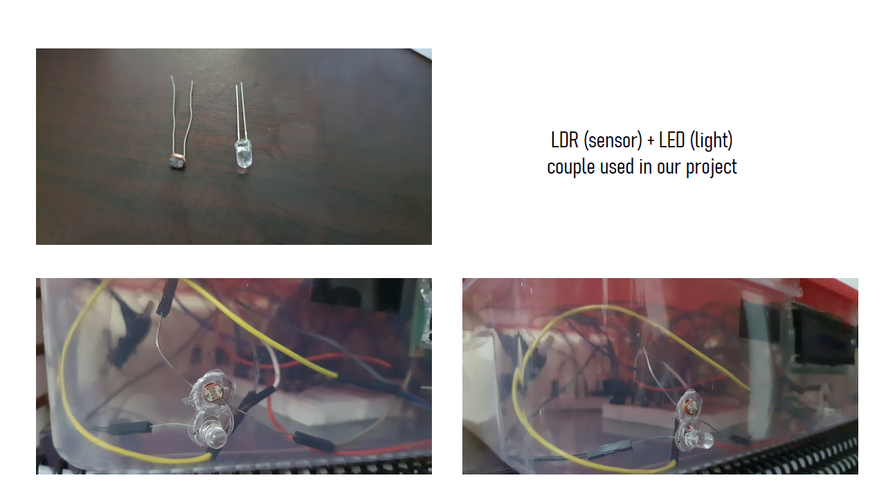

## Practice: Counter

**Instructions**: [[PDF]](/0-counter/instructions.md)

**Code**: Basic port I/O, delays [[Code]](/0-counter/main.c)

## Offline 1: LED matrix

**Instructions**: [[MD]](/1-led-matrix/instructions.pdf)

**Code**: Interrupts, LED matrix control  [[Code]](/1-led-matrix/main.c)

## Offline 2: ADC + LCD display

**Instructions**: [[PDF]](/2-adc/instructions.pdf)

**Code**: AD configuration, LCD interfacing [[Code]](/2-adc/main.c)

## Project: Gesture Based Elevator Control System

**Video Demonstration**: [YouTube](https://youtu.be/Lgz6mq2jmfk)

**Abstract**: *Since the onset of the COVID pandemic we have come to realize
the importance of touch-less systems. The health risks that come from
everyday usage of public touch-based information systems have en-
tered public awareness. These systems also have the added drawback
of being expensive and unsuitable for use in third world countries.
We need systems that are intuitive to novice and semi-educated users,
using cost-effective components that can be integrated into modern
systems. In response to these problems we have developed an eleva-
tor management system which uses finger gestures, one of the most
natural forms of communication. This system utilized low cost LDR
sensors and LEDs to detect finger gestures via reflection of light. The
system was tested to handle different corner cases for elevator systems
and designed to work with minimal user guidance.*

